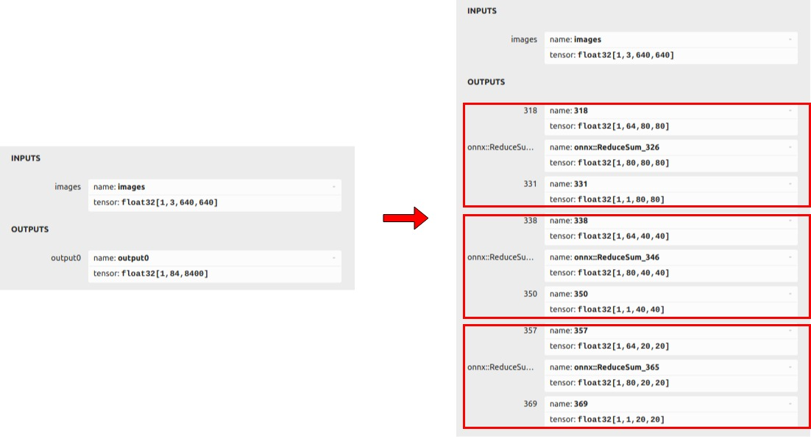
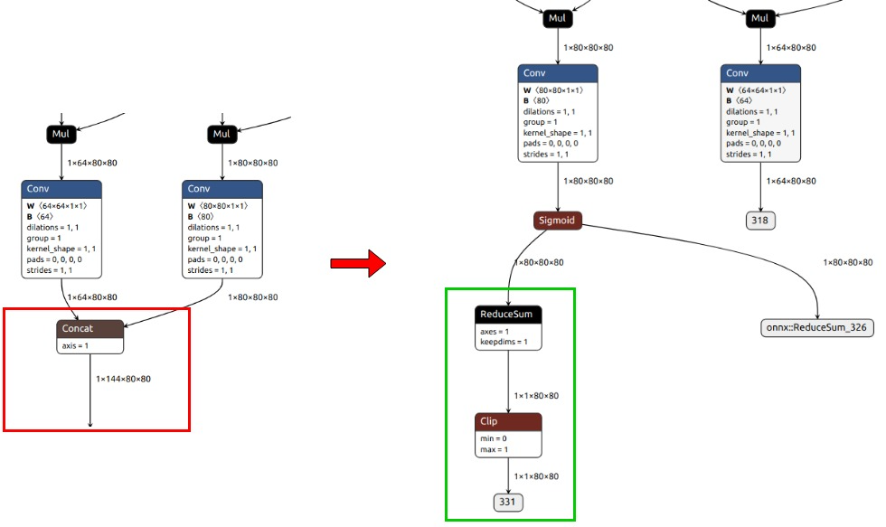
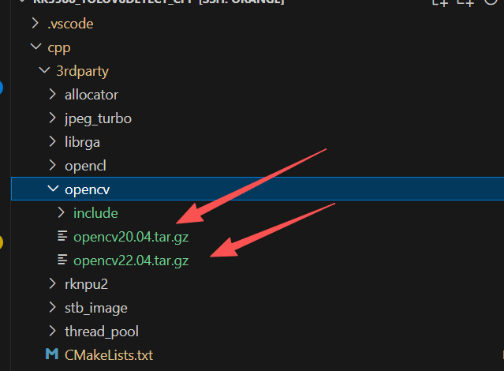
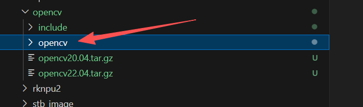
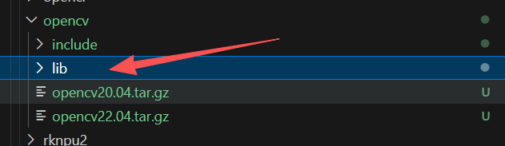
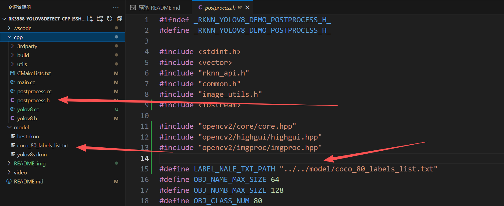
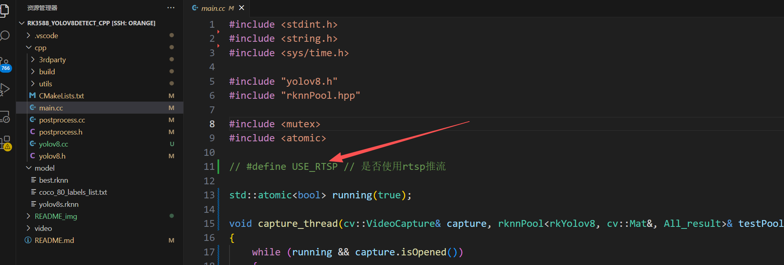

-  

# RK3588实现线程池推理yolov8(C++版本)

这里提供了C++版本的yolov8线程池推理的代码，我已经把全部要用到的动态库环境一同放到此项目中，所以无需去安装opencv已经RKNN等各种环境，拉下即可直接编译运行。这里提供线程池的版本和普通单线程的版本，另外也有对应的操作系统版本(Ubuntu22.04 和 Ubunty20.04)，你根据你的开发板情况去下载。


## 环境说明

### PC端（模型量化）

Python版本：conda环境，Python 3.10.16

操作系统：Ubuntu20.04

rknn-toolkit2版本：Version: 2.0.0b0+9bab5682rknn-toolkit2版本：Version: 2.0.0b0 9bab5682

```bash
# 可以通过这个指令查看
pip3 show rknn-toolkit2
```

### 香橙派rk3588端

Python版本：Python 3.10.12

操作系统：Ubuntu20.04 / Ubuntu22.04

NPU版本：RKNPU driver: v0.9.6（0.9.6版本的都兼容）

```bash
# 可通过下面这个查看
sudo cat /sys/kernel/debug/rknpu/version
```

rknn-toolkit-lite2：Version: 1.6.0

```bash
# 可以通过下面这个指令查看
pip3 show rknn-toolkit-lite2
```

## 模型相关结构说明

它们输出信息的对比如下。左侧是官方原始模型，右侧是优化后的模型。如图所示，原始模型的输出分为三组。以输出集合（[1,64,80,80]、[1,80,80,80]、[1,1,80,80]）为例，[1,64,80,80]表示边界框的坐标，[1,80,80,80]表示边界框对应80个类别的置信度，而[1,1,80,80]表示这80个类别置信度的总和。



以输出集合（[1,64,80,80]、[1,80,80,80]、[1,1,80,80]）为例，我们移除了模型中两个卷积节点后的子图，保留了这两个卷积的输出（[1,64,80,80]和[1,80,80,80]），并增加了一个reducesum+clip分支用于计算80个类别置信度的总和（[1,1,80,80]）。



yolov8模型rknn量化和转换参考这部分：

> [Fitz8863/RK3588_yolo_quantification](https://github.com/Fitz8863/RK3588_yolo_quantification)

## 运行代码步骤

拉取代码

```bash
git clone git@github.com:Fitz8863/RK3588_yolov8detect_cpp.git
```

进入项目

```bash
cd RK3588_yolov8detect_cpp
cd cpp
```

### opencv库文件的选择

进入到3rdparty文件夹下的opencv目录，这里可以看到下面两个压缩包，这两个分别是Ubuntu22.04 和 Ubunty20.04 对应的opencv库文件，你就根据你当前板子的操作系统去选择其中一个解压。



比如我的操作系统是Ubuntu22.04，那我执行下面这个解压指令

```bash
tar -xzf cpp/3rdparty/opencv/opencv22.04.tar.gz -C cpp/3rdparty/opencv
```

然后对解压的那个文件夹重命名就行了，解压后的名字是opencv，这里需要改成lib





完成上面的步骤，然后创建进入build目录

```bash
mkdir -p build && cd build
```

在build目录下执行cake 和 make

```bash
cmake -DCMAKE_INSTALL_PREFIX=../install ..
```

```bash
make -j8
```

最后执行

```bash
make install
```

可以看到生成了rknn_yolov8_demo 这个可执行程序，但是在此之前要执行下面这个语句，把库环境导入到当前终端中

```bash
export LD_LIBRARY_PATH=../install/lib
export LD_LIBRARY_PATH=../3rdparty/opencv/lib
```

然后运行测试视频代码

```bash
./rknn_yolov8_demo ../../model/yolov8s.rknn ../../video/spiderman.mp4
```

然后可以通过下面这个指令查看NPU的占用情况

```bash
watch sudo cat /sys/kernel/debug/rknpu/loa
```

## 补充说明

### 1、识别的类别

这里有一个文本，这个文本是表示要识别的类别，如果你要去推理你自己的模型的话，记得修改一下这个文本里面的内容



### 2、关于推流和ffmpeg

可以看到main.cc主文件的这里，这里有一个编译宏，默认注释掉是表示不使用推流，使用直接在显示屏显示推理后的视频；如果解开注释的话就表示使用推流的形式。

如果想部署相关流媒体服务器，可以参考这个:

> [搭建简易的rtsp服务器_rtsp-simple-server-CSDN博客](https://blog.csdn.net/m0_74279129/article/details/146427145)



下面这里是推流的指令，我是使用ffmpeg去推流的，这里需要设置推流的分辨率和帧率这些参数，这里你根据实际情况去设置就行了。还有就是 -c:v h264_rkmpp 这里是指定推流使用的H264流编码器 ，我这里指定是使用硬件编码也就是rk3588的 h264_rkmpp 编码器，如果你的设备不支持这个那请你把 h264_rkmpp 改成 libx264 就行了，这个是使用cpu默认编码。


这里我强烈建议你使用硬件编码去实现推流的操作。因为程序模型推理是属于非常吃开发板性能的，CPU软件编码本身就是很容易导致程序崩溃，具体教程可参考下面博客

> [rk3588 ffmpeg硬编码安装_rk3588 ffmpeg硬解码-CSDN博客](https://blog.csdn.net/qq_59164231/article/details/143510535)